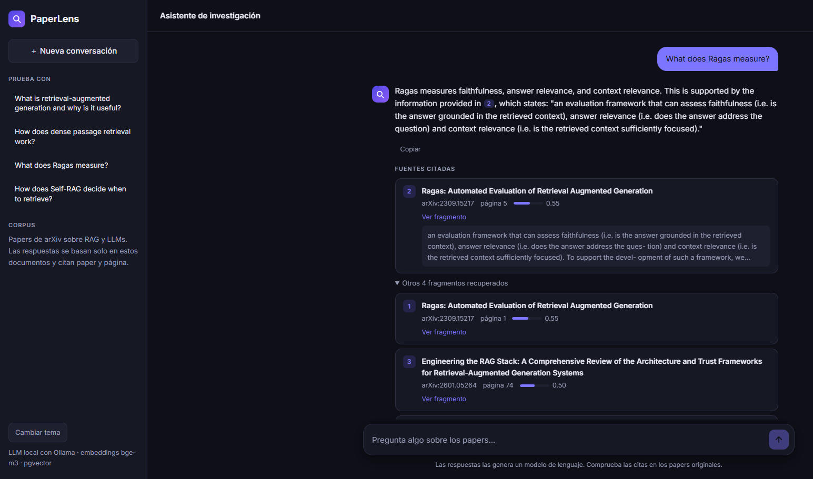

# PaperLens

Ask questions in natural language about a collection of arXiv papers and get answers **grounded only in those documents**, with citations to the paper and page. If the answer is not in the corpus, PaperLens says so instead of making something up.



## Features

- **Grounded answers with citations**: every claim is cited as `[1]`, `[2]`, and each citation links to the source paper at the exact page.
- **Honest refusals**: when the retrieved context does not contain the answer, the system replies *"No encuentro información sobre eso en los documentos."* and returns no sources.
- **Fully local and free**: embeddings (`BAAI/bge-m3`) and the LLM (Ollama) run on your machine. No paid API is needed.
- **Provider-agnostic LLM layer**: any OpenAI-compatible endpoint works (Ollama, Groq, Gemini, OpenRouter). Switching provider means changing three variables in `.env`, no code.
- **Idempotent ingestion**: re-running the pipeline skips papers that are already stored.
- **Web chat** with Markdown and LaTeX rendering, clickable citations, dark/light theme and a responsive layout.

## How it works

```
 INGESTION (once)                              QUESTION ANSWERING (per request)

 PDFs ──► extract text per page (PyMuPDF)      question ──► embed (bge-m3)
      ──► chunk: 300 words, 40 overlap                 ──► top-k cosine search (pgvector, HNSW)
      ──► embed chunks (bge-m3, batches)               ──► prompt: rules + numbered passages + question
      ──► store in PostgreSQL + pgvector               ──► LLM (Ollama, via OpenAI-compatible API)
                                                       ──► answer + sources (paper, page, snippet)
```

The whole pipeline is written by hand, with no LangChain or LlamaIndex, to make every step explicit.

## Stack

Python 3.11+ · FastAPI · PostgreSQL 16 + pgvector · sentence-transformers (`BAAI/bge-m3`, 1024 dimensions) · PyMuPDF · Ollama (`qwen2.5:7b` by default) · `openai` SDK as a plain HTTP client · pydantic-settings · pytest · ruff

## Getting started

### Prerequisites

- [Docker](https://docs.docker.com/get-docker/) with Compose
- [uv](https://docs.astral.sh/uv/) (or any way to get Python 3.11+)
- [Ollama](https://ollama.com/download)

### Setup

```bash
git clone https://github.com/pacopedrosa/PaperLens.git && cd PaperLens

cp .env.example .env              # adjust values if needed
docker compose up -d              # PostgreSQL + pgvector (creates the schema on first start)

uv venv --python 3.12
source .venv/bin/activate
uv pip install -e ".[dev]"

ollama pull qwen2.5:7b            # about 4.7 GB, one time
```

### Build the corpus and run

```bash
python scripts/download_arxiv.py          # downloads ~40 papers into data/pdfs/ + metadata.jsonl
python -m paperlens.ingest.pipeline       # parse, chunk, embed and store (~20 min on CPU, once)
uvicorn paperlens.api.main:app --reload   # http://localhost:8000
```

Open <http://localhost:8000> for the chat, or <http://localhost:8000/docs> for the interactive API docs.

### Ask from the command line

```bash
curl -X POST http://localhost:8000/ask \
  -H "Content-Type: application/json" \
  -d '{"question": "What does Ragas measure?", "k": 5}'
```

```json
{
  "answer": "Ragas measures faithfulness, answer relevance and context relevance [2].",
  "sources": [
    {"number": 2, "arxiv_id": "2309.15217", "title": "Ragas: ...", "page": 5,
     "snippet": "an evaluation framework that can assess faithfulness ...", "similarity": 0.55}
  ]
}
```

Each source `number` matches the `[n]` citations in the answer. On a CPU-only machine an answer takes about a minute, almost all of it spent in the LLM.

## Configuration

All settings are environment variables, read from `.env` (see `.env.example`).

| Variable | Default | Description |
|---|---|---|
| `DATABASE_URL` | *(required)* | PostgreSQL connection string. Must match the `POSTGRES_*` values |
| `POSTGRES_USER` / `POSTGRES_PASSWORD` / `POSTGRES_DB` / `POSTGRES_PORT` | `paperlens` / `paperlens` / `paperlens` / `5432` | Used by `docker-compose.yml` |
| `EMBEDDING_MODEL` | `BAAI/bge-m3` | Changing it requires changing `vector(1024)` in `db/init.sql` |
| `LLM_BASE_URL` | `http://localhost:11434/v1` | Any OpenAI-compatible endpoint |
| `LLM_API_KEY` | `ollama` | Ollama ignores it, other providers need a real key |
| `LLM_MODEL` | `qwen2.5:7b` | Model name as the provider knows it |

## Project structure

```
db/init.sql                  schema: documents, chunks (vector + full-text columns, HNSW and GIN indexes)
scripts/download_arxiv.py    download papers and their metadata from arXiv
src/paperlens/
  config.py                  settings (pydantic-settings)
  ingest/                    parsing.py · chunking.py · embeddings.py · store.py · pipeline.py
  retrieval/search.py        question -> top-k chunks by cosine similarity
  llm/client.py              generate(system, user): the only function that talks to the LLM
  llm/prompt.py              system prompt and context formatting
  rag.py                     retrieve -> prompt -> generate -> answer with sources
  api/                       FastAPI app and the web chat (static/index.html)
tests/                       pytest suite
eval/                        golden_set.jsonl and run_eval.py (retrieval evaluation)
```

## Design decisions

This is what I chose, what I gave up, and what I measured along the way.

**No frameworks in Stage 1.** I wrote the pipeline by hand instead of using LangChain or LlamaIndex, because the goal was to understand every step: parsing, chunking, embedding, retrieval and prompting. Once the baseline is measured, comparing it against a framework version is a fair experiment.

**Chunks never cross page boundaries.** I could have chunked the whole document and tracked which pages each chunk touches, but then a citation could point to the wrong page. Splitting per page keeps every citation exact. The cost is that a sentence running across two pages gets cut, and each page leaves a short trailing chunk (39 of the 1,842 chunks have fewer than 50 words). I have not tuned this yet; I will decide with the evaluation set instead of guessing.

**Chunk size counted in words, not tokens.** 300 words with a 40-word overlap is roughly 400 and 50 tokens, which sits in the usual 300-500 range. Using the real tokenizer would be more precise, but counting words let me focus on the mechanics first. It is a one-function change when I want to test it.

**Default PDF reading order.** On two-column papers, PyMuPDF's `sort=True` interleaves lines from both columns and breaks sentences in half, so I kept the default order. This is still imperfect: formulas and tables come out garbled, and end-of-line hyphenation (`ques- tion`) is not cleaned yet.

**Cosine similarity with an HNSW index.** bge-m3 already returns normalized vectors, and the index operator class (`vector_cosine_ops`) matches the `<=>` operator in the query, so the index is actually used. If the embedding model changes, `vector(1024)` in `db/init.sql` has to change too.

**Idempotent ingestion, one transaction per paper.** The pipeline asks the database whether a paper exists before computing embeddings, which is the slow part (about 25 seconds per paper on CPU). Each paper is saved atomically, so a crash never leaves a document without chunks. Running the real corpus also showed me that 30 chunks contain NUL characters, which PostgreSQL rejects in text columns, so they are stripped before saving.

**The model must be able to say "I don't know".** Vector search always returns `k` results, even for an unrelated question. In my tests, relevant questions scored around 0.64-0.73 cosine similarity and an unrelated one around 0.39-0.46, so there is room for a similarity threshold, but I have not set one. For now the prompt forces a fixed refusal sentence, and when the model uses it the API returns no sources, because the retrieved chunks are not real evidence for anything.

**One LLM entry point.** Everything calls `generate(system, user)`, and the provider is configuration. I run Ollama locally so the project costs nothing.

**CPU-only trade-off.** On my machine (no GPU) a full answer takes about a minute, almost all of it in the 7B model. I accepted that for zero cost and full privacy. Streaming the answer is planned for Stage 4, since it is what makes the wait tolerable.

**Tests that cannot touch real data.** The database tests run inside a transaction that is always rolled back. I added that after a first version of the tests leaked three test documents into my real database, because `save_document` opens a real transaction when none is open yet.

## Tests

```bash
python -m pytest -q
```

43 tests: unit tests for parsing, chunking, the prompt and the evaluation metrics; checks that the golden set is well formed; tests for the RAG pipeline and the API with the LLM and the database replaced by fakes; and integration tests against the real PostgreSQL, which run inside a transaction that is always rolled back and are skipped if the database is not available.

## Roadmap

- [x] **Stage 1**: ingestion pipeline and basic `/ask`, without frameworks
- [x] **Stage 2**: golden set (40 questions) and evaluation with recall@k and MRR
- [ ] **Stage 3**: better retrieval, each change measured: chunking strategies, hybrid search (BM25 + vectors), reranking
- [ ] **Stage 4**: Next.js + TypeScript interface with streaming and citations
- [ ] **Stage 5**: observability, caching and CI with automatic evaluation

## Evaluation results

I measure retrieval on its own, without the LLM, so a full run takes seconds instead of minutes. If the right chunk never reaches the prompt, the model cannot answer correctly however good it is.

```bash
python -m eval.run_eval              # metrics only
python -m eval.run_eval --failures   # also show what was returned for weak questions
```

### The golden set

`eval/golden_set.jsonl` has 40 questions in Spanish, one JSON object per line: `id`, `question`, `answer`, `arxiv_id`, `pages` and `type`. 36 have an answer in the corpus (16 different papers; 16 factual, 17 conceptual, 3 paraphrased) and 4 are unanswerable on purpose (for example "What is the capital of Mongolia?"). Unanswerable questions have no correct chunk, so they are left out of the retrieval metrics; they are meant to check that the full system refuses.

A retrieved chunk counts as correct when its paper matches and its page is in `pages`. I wrote the questions by paraphrasing, not copying the text, because a benchmark made of copied sentences only measures word overlap. I verified the pages against the real chunk text, and some questions do not name the paper (as a real user would not), which makes them harder.

### Baseline (Stage 2)

Dense search only: bge-m3 embeddings, cosine similarity, chunks of 300 words with 40 overlap. 36 questions.

| Version | recall@1 | recall@3 | recall@5 | recall@10 | MRR |
|---|---|---|---|---|---|
| Baseline | 0.50 | 0.69 | 0.83 | 0.94 | 0.63 |

recall@k is the share of questions with at least one correct chunk in the top k. MRR averages 1/rank of the first correct chunk, so it rewards putting it near the top. The API uses `k=5`, which means about one question in six never gets its evidence into the prompt.

### What I learned from the first run

My first numbers were lower (recall@5 0.72, MRR 0.52), but the search had not changed: my golden set was wrong. Reading the failures one by one showed that several correct chunks were being counted as misses because I had listed too few pages, and one question was so generic that it could belong to any paper. I fixed only the cases where the chunk text showed the answer, and I now treat this version as frozen so the numbers cannot drift upward by editing the exam.

The failures that remain look real and are the starting point for Stage 3:

- Numbers that appear in an abstract lose against tables full of similar numbers (the BM25 vs. DPR question).
- A chunk that defines a term can lose against the introduction of the same paper when the question paraphrases the term (salient span masking).
- Questions that do not name the paper can be pulled toward other papers on the same topic.

## License

MIT, see [LICENSE](LICENSE).
